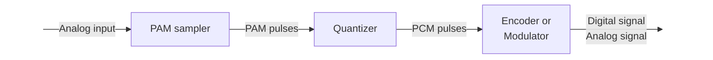

# Digitization

Analog Data면 Digital Data로 변환해야 함  
요즘 세상에선 통신할 때보단 애초에 컴퓨터에 저장할 때부터 Digital Data로 변환 후 저장

Analog to Digital conversion을 담당하는 애를 codec이라고 함

## PCM(Pulse Code Modulation)

당연히 샘플링을 무한번 해서 보내면 Analog Data 완벽하게 보낼 수 있음  
But 현실적으로는 불가능

Sampling을 몇 번 해야 할까?

### Nyquist's sampling Theorem

가장 높은 signal frequency보다 2배 이상 빠르게 샘플링을 하면 샘플이 Analog Data의 모든 정보를 포함하게 된다!

ex) 사람 목소리의 유효 주파수는 대략 3400Hz -> 샘플링을 8000Hz로 하면 된다  
한 sample이 8bit라면 64kbps

Analog Signal  
-> PAM pulses: sampling한 진폭  
-> PCM pulses: (8bit로) encoding한 진폭  
-> PCM output: bits (Digital Signal)

문제점: Quantization에 의해 손실이 일어남

해결책: Nonlinear encoding / Companding + linear encoding

사실 그냥 샘플링 하는 비트 수인 n을 늘리는 방법이 있음 물론 이러면 데이터가 늘어남

### Nonlinear coding

애초에 진폭이 클 땐 잘 sampling 됨; 진폭이 작을 때가 문제

0 근처는 조밀조밀하게 encoding, 0 바깥쪽은 큼직큼직하게 encoding

### Companding

Companding = compressing-expanding

애초에 인풋을 바꾸면 되지 않나? 진폭이 작은 부분을 크게 만듦

## DM(Delta Modulation)

n=1, 즉 모든 샘플은 1bit

샘플이 1bit라 PCM보다 높은 주파수가 필요하지만 구현이 훨씬 쉬움

$\delta$를 사용함, 변수 하나 0부터 시작

- 샘플이 현재 값보다 크면 변수 $\delta$ 증가, 신호는 1로
- 샘플이 현재 값보다 작으면 변수 $\delta$ 감소, 신호는 0으로

Slope overload noise
: 최대 $\delta$만큼만 변해서 발생하는 noise

Quantizing noise
: 최소 $\delta$만큼 변해야 해서 발생하는 noise

# Transmisssion Errors

각종 이유로 bit가 송신할 때랑 수신할 때랑 바뀔 수가 있음

Single bit Error
: 1비트만 에러가 생긴 경우. white noise 때문일 수 있음

Burst Error
: 연속된 B비트 중 일부가 에러가 생긴 경우. date rate 높으면 큰일남

## Error detection & Retransmission

에러 감지한 다음 있으면 ARQ(Automatic repeat request) protocol 보냄  
수신자는 에러 발생한 블록 전부 버리고 송신자가 다시 데이터 보냄

하지만 요즘 쓰기엔 어려운 방법임

- 애초에 다시 데이터를 보냈는데 또 에러가 터지면? -> 계속 보내야함
- 요즘 transmission rate가 너무 높음; 전송해야 할 비트도 많고 에러날 확률도 높음
- 통신은 항상 순서대로 보내야함; ARQ 받으면 처음부터 다시 보내야 함

### Parity Check

각 데이터에 1의 개수가 짝수가 되도록 1개의 parity bit 추가

Single bit Error는 완벽하게 잡지만, Burst Error는 잘 못 잡음

## Error correction codes, or forward error correction (FEC)

Error detection -> 문제 많음

FEC는 에러를 찾는 동시에 고침!
